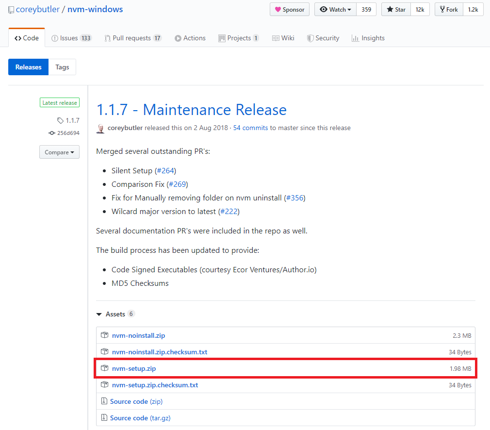

### 목차

1. 기존 설치되어있던 nodejs와 npm과련 폴더 삭제(nodejs 설치시 자동설치됨)

2. nvm 설치

3. nvm을 이용하여 nodejs 설치

4. 설치된 nodejs 리스트 조회

5. nvm을 이용하여 설치된 nodejs 버전별 선택하여 사용 설정

## 기존 설치되어있던 nodejs와 npm과련 폴더 삭제(nodejs 설치시 자동설치됨)

- [nvm-windows](https://github.com/coreybutler/nvm-windows/releases) 설치시 npm설정이 업데이트가 되지 않기때문에 nodejs와 npm 관련 폴더를 모두 삭제한다.

* npm 폴더위치

```shell
  C:\Users\AppData\Roaming\npm
  C:\Users\AppData\Roaming\npm-cache
```

## nvm설치

- [nvm-windows](https://github.com/coreybutler/nvm-windows/releases)을 다운 받을 수 있는 사이트로 이동한다.
- nvm-setup.zip 파일을 다운받은 후 PC에 설치를 진행한다.
- 설치팝업창에서 next 버튼을 클릭하여 기본설치를 한다.
  

## nvm을 이용하여 nodejs 설치

nvm 설치가 끝났으면 설치하고자 하는 nodejs버전을 nvm 명령어를 이용하여 설치한다.

```shell
  > nvm instail v10.13.0
  > nvm instail v12.16.1

  위와 같이 여러 버전의 nodejs 를 설치 할 수 있다.
```

## 설치된 nodejs 리스트 조회

```shell
  > nvm list
```

## nvm을 이용하여 설치된 nodejs 버전별 선택하여 사용 설정

```shell
>  nvm use 10.13.0
```

### 목차

1. 기존 설치되어있던 nodejs와 npm과련 폴더 삭제(nodejs 설치시 자동설치됨)

2. nvm 설치

3. nvm을 이용하여 nodejs 설치

4. 설치된 nodejs 리스트 조회

5. nvm을 이용하여 설치된 nodejs 버전별 선택하여 사용 설정
