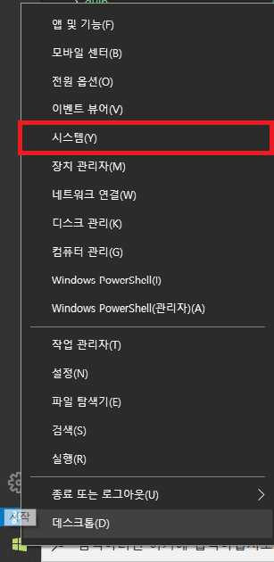
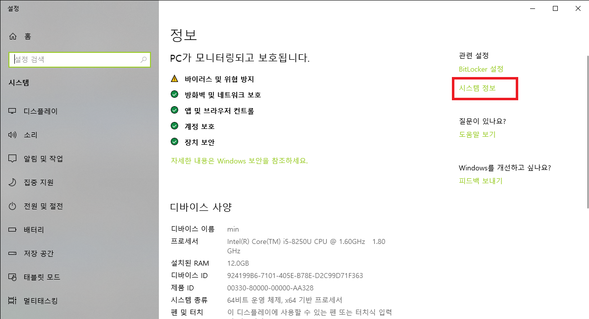
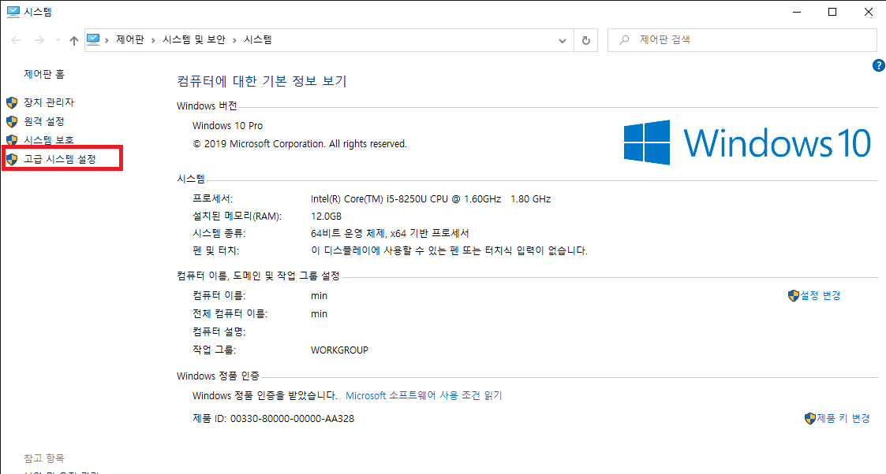
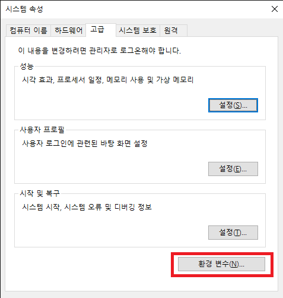
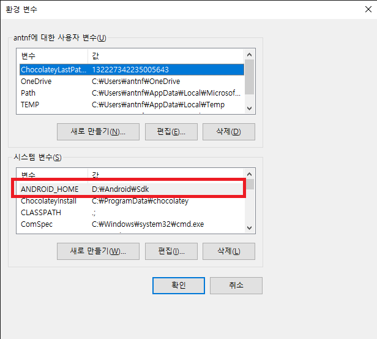
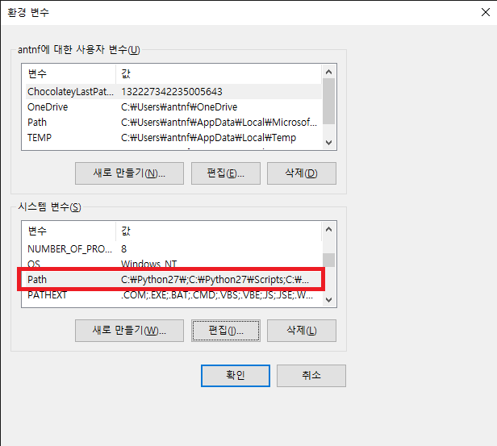
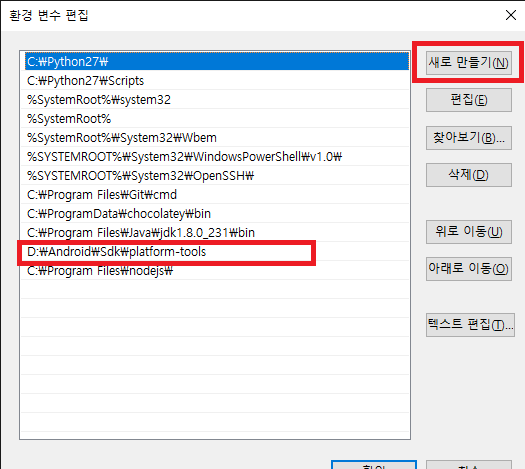

[React Native](https://facebook.github.io/react-native/docs/getting-started) 시작하기 위해서 패키지관리툴, 의존성 패키지설치, 안드로이드 스튜디오 설치등을
추후 다시 세팅해야될경우를 대비하여 정리해놓는다.

### 개발환경

> Windows 10<br>
> React Native CLI<br>
> React Native 0.61
> Android Device<br>
> Android 10
> Visual Studio Code

### 1. 패키지관리툴 chocolately 설치

> [React Native](https://facebook.github.io/react-native/docs/getting-started) 에서 추천하는[chocolately](https://chocolatey.org/install)을 설치한다.<br>
> PowerShell에서 아래 구문을 실행하면 [chocolately](https://chocolatey.org/install)가 다운로드된다.

```shell
Set-ExecutionPolicy Bypass -Scope Process -Force; iex ((New-Object System.Net.WebClient).DownloadString('https://chocolatey.org/install.ps1'))
```

### 2. 의존성 패키지 설치

> 이미 설치되어있는 패키지는 제외하고 설치한다.

```shell
choco install -y nodejs.install python2 jdk8
또는
choco install -y nodejs.install
-> nodejs 설치시 위명령어를 사용하지말고 수동으로 10.13.0버전 다운받아 설치할것!!!!!
-> 12.x.x 또는 13.x.x버전 설치시 npx react-native run-android 실행시 오류발생
choco install -y python2
choco install -y jdk8
```

### 3. [안드로이드 스튜디오](https://developer.android.com/studio/index.html) 설치

> 안드로이드 스튜디오 설치 후 환경변수를 설정한다.
> Sdk가 설치된 각자 경로를 찾아 아래와 같이 등록한다.

```shell
ANDROID_HOME
    D:\Android\Sdk
Path
    D:\Android\Sdk\platform-tools
```

1. 왼쪽아래 윈도우키 위에서 마우스 오른쪽 버튼을 클릭한 후 "시스템"을 선택한다.
   

2. 오른쪽 상단의 "시스템 정보" 를 선택한다.
   
3. 고급 시스템 설정을 선택한다.
   
4. 환경변수를 선택한다.
   
5. ANDROID_HOME 시스템 변수를 신규 생성한다.
   
6. Path 시스템변수를 더블 클릭한다.
   
7. Path 시스템변수에 platform-tools 의 경로를 추가한다.
   

### 5. npx를 사용하여react native 프로젝트 생성

> 기존 react-native-cli 패키지가 설치되어있다면
> 삭제 후 npx를 사용하여 프로젝트를 생성한다.

```shell
npx react-native init 프로젝트명
```

- 아래 명령어는 React Native 특정버전을 설치하는 구문이다.

```shell
npx react-native init 프로젝트명 --version X.XX.X
```

- 아래 명령어는 React Native 템플릿 지정하여 설치(TypeScript)한다.

```shell
npx react-native init 프로젝트명 --template react-native-template-typescript
```

> visual studio code 에서 프로젝트를 실행한다.

```shell
npx react-native run-android
```

### 설치시 발생한 오류 및 해별방법(물리device사용)

- 발생오류

```shell
  adb.exe: error: closed
  warn Failed to connect to development server using "adb reverse": Command failed: D:\Android\Sdk/platform-tools/adb -s 42f6160121e9cffd reverse tcp:8081 tcp:8081
```

- 발생원인

  > 안드로이드 5.0 미만버전을 사용하여 발생함

- 해결방법

  > 안드로이드 device를 9.0 버전이 설치된 기기로 바꿔서 실행하니 오류발생안함.

### 기타 설치시 오류해결을 위해서 사용하였던 명령어들 모음

```shell
adb reverse tcp:8081 tcp:8081

adb usb
adb sideload

  cd android
  gradlew clean
```
